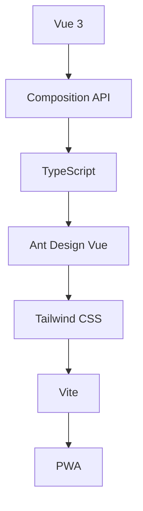
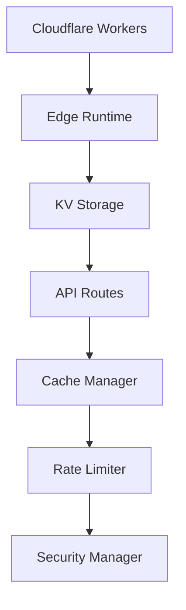

# 🚀 ProSub - 专业级代理订阅管理平台

<div align="center">


**基于 Cloudflare Pages + KV 的高性能代理订阅管理平台**

[](https://pages.cloudflare.com/)
[](LICENSE)

</div>

---

## ✨ 核心特性

### 🎯 智能节点管理
- **多协议支持**: Vmess, VLESS, SS, Trojan, SSR, Hysteria2
- **智能健康检查**: 实时检测节点状态和延迟
- **批量操作**: 支持批量导入、删除、去重
- **智能排序**: 按延迟、状态、类型自动排序
- **实时搜索**: 快速定位目标节点

### 📡 订阅聚合管理
- **多源聚合**: 支持多个机场订阅源
- **自动更新**: 定时更新订阅内容
- **状态监控**: 实时显示订阅状态和节点数量
- **预览功能**: 无需下载即可预览订阅内容
- **批量导入**: 一键导入多个订阅链接

### ⚙️ 配置文件生成
- **可视化配置**: 穿梭框界面，直观组合节点
- **多客户端支持**: Clash, Surge, Quantumult X, Loon, Sing-Box
- **规则集管理**: 自定义分流规则
- **实时预览**: 配置生成前预览效果

### 🔐 安全与性能
- **用户认证**: 内置用户管理系统
- **缓存优化**: 多层缓存提升响应速度
- **速率限制**: 防止API滥用
- **安全防护**: IP封禁、请求验证
- **PWA支持**: 可安装为桌面应用

## 🏗️ 技术架构

### 前端技术栈


### 后端技术栈


### 核心模块
- **数据访问层**: `NodeDataAccess`, `SubscriptionDataAccess`
- **缓存系统**: `CacheManager`, `NodeHealthCache`, `SubscriptionCache`
- **安全系统**: `SecurityManager`, `RateLimiter`
- **前端组件**: `useApi`, `useNodes`, `useSubscriptions`

## 🚀 快速开始

### 环境要求
- Node.js 18+
- Git
- Cloudflare 账户

### 一键部署

#### 1. Fork 项目
```bash
# 克隆项目
git clone https://github.com/your-username/ProSub.git
cd ProSub
```

#### 2. 配置 Cloudflare
1. 登录 [Cloudflare Dashboard](https://dash.cloudflare.com/)
2. 创建 KV 命名空间: `Workers & Pages` → `KV` → `Create namespace`
3. 记录命名空间 ID

#### 3. 部署到 Pages
1. 进入 `Workers & Pages` → `Create application` → `Pages`
2. 连接 GitHub 仓库
3. 配置构建设置:
   - **Framework preset**: Vue
   - **Build command**: `npm run build`
   - **Build output directory**: `dist`
4. 添加环境变量:
   - `KV_NAMESPACE_ID`: 你的 KV 命名空间 ID

#### 4. 配置 Worker 绑定
1. 在 Pages 项目设置中添加 Worker binding
2. 变量名: `KV`
3. 选择你的 KV 命名空间

### 本地开发

```bash
# 安装依赖
npm install

# 启动开发服务器
npm run dev

# 构建生产版本
npm run build

# 类型检查
npm run type-check

# 代码格式化
npm run format
```

## 📖 使用指南

### 首次登录
- **用户名**: `admin`
- **密码**: `admin123`
- 首次登录后请立即修改密码

### 节点管理
1. 进入 **节点管理** 页面
2. 点击 **添加节点** 或 **批量导入**
3. 支持多种导入方式:
   - 手动输入节点信息
   - 从剪贴板批量导入
   - 从订阅链接导入

### 订阅管理
1. 进入 **订阅管理** 页面
2. 添加订阅链接
3. 设置更新频率
4. 预览订阅内容

### 配置文件
1. 进入 **配置文件** 页面
2. 创建新配置
3. 选择节点和订阅
4. 生成订阅链接

## 🔧 高级配置

### 环境变量
```bash
# KV 存储配置
KV_NAMESPACE_ID=your_namespace_id

# 安全配置
SECURITY_ENABLED=true
RATE_LIMIT_ENABLED=true

# 缓存配置
CACHE_TTL=3600
HEALTH_CHECK_INTERVAL=300
```

### 自定义规则集
```yaml
# 在 packages/shared/rulesets/ 中添加自定义规则
rules:
  - DOMAIN-SUFFIX,example.com,DIRECT
  - DOMAIN-KEYWORD,google,PROXY
```

## 📊 性能优化

### 缓存策略
- **节点健康检查**: 5分钟缓存
- **订阅内容**: 10分钟缓存
- **统计数据**: 1小时缓存

### 速率限制
- **API 请求**: 100次/分钟
- **登录尝试**: 5次/分钟
- **订阅更新**: 10次/小时

### 安全措施
- **IP 封禁**: 自动封禁恶意IP
- **请求验证**: 验证请求来源和格式
- **安全日志**: 记录安全事件

## 🤝 贡献指南

### 开发流程
1. Fork 项目
2. 创建功能分支: `git checkout -b feature/amazing-feature`
3. 提交更改: `git commit -m 'Add amazing feature'`
4. 推送分支: `git push origin feature/amazing-feature`
5. 创建 Pull Request

### 代码规范
- 使用 TypeScript 严格模式
- 遵循 Vue 3 Composition API 最佳实践
- 使用 ESLint + Prettier 格式化代码
- 编写单元测试

## 📝 更新日志

### v2.0.0 (2024-01-XX)
- ✨ 全新架构设计
- 🚀 性能大幅提升
- 🔐 增强安全措施
- 📱 优化移动端体验
- 🎨 现代化UI设计

### v1.0.0 (2024-01-XX)
- 🎉 初始版本发布
- 📡 基础订阅管理
- 🖥️ 节点管理功能
- ⚙️ 配置文件生成

## 📄 许可证

本项目采用 [MIT 许可证](LICENSE)。

## 🙏 致谢

- [Vue.js](https://vuejs.org/) - 渐进式JavaScript框架
- [Ant Design Vue](https://antdv.com/) - 企业级UI组件库
- [Cloudflare](https://cloudflare.com/) - 边缘计算平台
- [Tailwind CSS](https://tailwindcss.com/) - 实用优先的CSS框架

---

<div align="center">

**如果这个项目对您有帮助，请给个 ⭐️ Star 支持一下！**

[](https://github.com/your-username/ProSub)
[](https://github.com/your-username/ProSub)

</div>