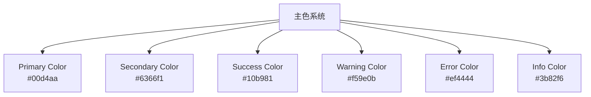
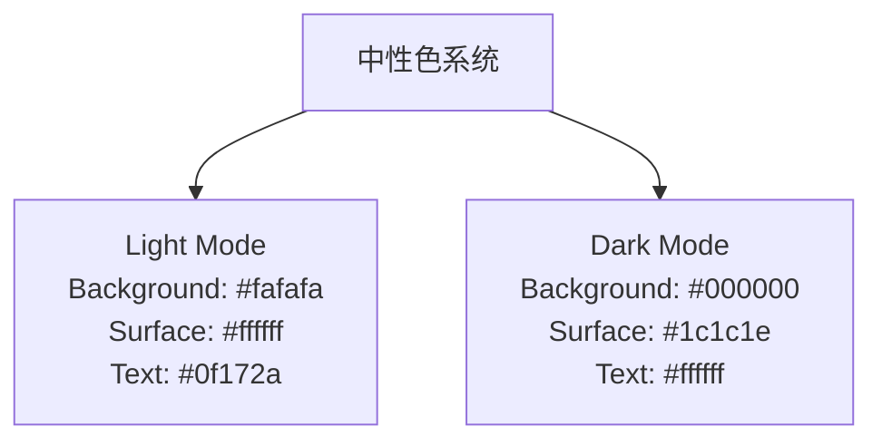

# UI美化改造任务序列 - 技术设计文档

## 1. 引言

### 1.1 目的
本文档详细描述ProSub项目UI美化改造的技术实现方案，包括颜色系统重构、组件样式优化和深色模式适配。

### 1.2 范围
本设计涵盖以下改造领域：
1. 配色系统优化
2. 模态窗口组件优化
3. 按钮组件优化
4. 消息提示组件优化
5. 标签组件优化

## 2. 设计原则

### 2.1 可访问性优先
- 所有颜色组合必须满足WCAG 2.0 AA标准(至少4.5:1对比度)
- 提供足够的视觉区分度以支持色觉障碍用户

### 2.2 一致性
- 建立统一的颜色命名和使用规范
- 保持组件在不同页面中的一致性表现

### 2.3 可维护性
- 颜色变量集中管理
- 组件样式模块化设计
- 清晰的CSS类命名规范

## 3. 颜色系统设计

### 3.1 主色系统


### 3.2 中性色系统


### 3.3 状态色系统
```mermaid
graph TD
    A[状态色系统] --> B[Online Status<br>Light: #f6ffed<br>Dark: rgba(82, 196, 26, 0.2)]
    A --> C[Offline Status<br>Light: #fff2f0<br>Dark: rgba(255, 77, 79, 0.2)]
    A --> D[Checking Status<br>Light: #e6f7ff<br>Dark: rgba(24, 144, 255, 0.2)]
    A --> E[Unknown Status<br>Light: #fafafa<br>Dark: rgba(140, 140, 140, 0.2)]
```

### 3.4 节点类型色系统
```mermaid
graph TD
    A[节点类型色系统] --> B[VMess<br>Light: #e6f7ff<br>Dark: rgba(24, 144, 255, 0.2)]
    A --> C[VLESS<br>Light: #f6ffed<br>Dark: rgba(82, 196, 26, 0.2)]
    A --> D[Trojan<br>Light: #f9f0ff<br>Dark: rgba(114, 46, 209, 0.2)]
    A --> E[Shadowsocks<br>Light: #fff7e6<br>Dark: rgba(250, 140, 22, 0.2)]
    A --> F[ShadowsocksR<br>Light: #fff2f0<br>Dark: rgba(255, 77, 79, 0.2)]
```

## 4. 组件优化设计

### 4.1 模态窗口优化设计

#### 4.1.1 关闭按钮设计
```css
/* 模态窗口关闭按钮样式 */
.ant-modal-close {
  color: var(--text-primary);
  background: transparent;
  border-radius: var(--radius-lg);
  transition: all var(--transition-fast);
}

.ant-modal-close:hover {
  background: var(--color-fill-tertiary);
  color: var(--primary-color);
}

.dark .ant-modal-close {
  color: var(--text-primary);
}

.dark .ant-modal-close:hover {
  background: rgba(10, 132, 255, 0.1);
  color: var(--primary-color);
}
```

#### 4.1.2 标题文字设计
```css
/* 模态窗口标题样式 */
.ant-modal-title {
  color: var(--text-primary);
  font-weight: 600;
  font-size: var(--font-size-lg);
}
```

### 4.2 按钮优化设计

#### 4.2.1 主要按钮设计
```css
/* 主要按钮样式 */
.ant-btn-primary {
  background: var(--primary-color);
  border-color: var(--primary-color);
  color: white;
  box-shadow: 0 2px 4px rgba(0, 212, 170, 0.2);
}

.ant-btn-primary:hover, .ant-btn-primary:focus {
  background: var(--primary-dark);
  border-color: var(--primary-dark);
  box-shadow: 0 4px 8px rgba(0, 212, 170, 0.3);
  transform: translateY(-1px);
}
```

#### 4.2.2 次要按钮设计
```css
/* 次要按钮样式 */
.ant-btn-default {
  border-color: var(--border-color);
  color: var(--text-primary);
  background: var(--card-bg);
}

.ant-btn-default:hover {
  border-color: var(--primary-color);
  color: var(--primary-color);
  background: var(--primary-50);
}
```

#### 4.2.3 文字按钮设计
```css
/* 文字按钮样式 */
.ant-btn-text {
  background: transparent;
  color: var(--text-primary);
}

.dark .ant-btn-text {
  background: rgba(152, 152, 159, 0.1);
  color: var(--text-primary);
}

.dark .ant-btn-text:hover {
  background: rgba(10, 132, 255, 0.1);
  color: var(--primary-color);
}
```

### 4.3 消息提示优化设计

#### 4.3.1 成功消息设计
```css
/* 成功消息样式 */
.ant-message-success .ant-message-notice-content {
  background: var(--color-success-bg);
  border: 1px solid var(--color-success-border);
  color: var(--color-success);
}

.dark .ant-message-success .ant-message-notice-content {
  background: rgba(82, 196, 26, 0.2);
  border: 1px solid rgba(82, 196, 26, 0.5);
  color: #52c41a;
}
```

#### 4.3.2 错误消息设计
```css
/* 错误消息样式 */
.ant-message-error .ant-message-notice-content {
  background: var(--color-error-bg);
  border: 1px solid var(--color-error-border);
  color: var(--color-error);
}

.dark .ant-message-error .ant-message-notice-content {
  background: rgba(255, 77, 79, 0.2);
  border: 1px solid rgba(255, 77, 79, 0.5);
  color: #ff4d4f;
}
```

### 4.4 标签优化设计

#### 4.4.1 状态标签设计
```css
/* 状态标签样式 */
.ant-tag.status-online {
  background: var(--tag-online-bg);
  border: 1px solid var(--tag-online-border);
  color: var(--tag-online-color);
}

.ant-tag.status-offline {
  background: var(--tag-offline-bg);
  border: 1px solid var(--tag-offline-border);
  color: var(--tag-offline-color);
}

.ant-tag.status-checking {
  background: var(--tag-checking-bg);
  border: 1px solid var(--tag-checking-border);
  color: var(--tag-checking-color);
}

.ant-tag.status-unknown {
  background: var(--tag-unknown-bg);
  border: 1px solid var(--tag-unknown-border);
  color: var(--tag-unknown-color);
}
```

#### 4.4.2 节点类型标签设计
```css
/* 节点类型标签样式 */
.ant-tag.type-vmess {
  background: var(--tag-vmess-bg);
  border: 1px solid var(--tag-vmess-border);
  color: var(--tag-vmess-color);
}

.ant-tag.type-vless {
  background: var(--tag-vless-bg);
  border: 1px solid var(--tag-vless-border);
  color: var(--tag-vless-color);
}

.ant-tag.type-trojan {
  background: var(--tag-trojan-bg);
  border: 1px solid var(--tag-trojan-border);
  color: var(--tag-trojan-color);
}

.ant-tag.type-ss {
  background: var(--tag-ss-bg);
  border: 1px solid var(--tag-ss-border);
  color: var(--tag-ss-color);
}

.ant-tag.type-ssr {
  background: var(--tag-ssr-bg);
  border: 1px solid var(--tag-ssr-border);
  color: var(--tag-ssr-color);
}
```

## 5. 深色模式适配设计

### 5.1 颜色变量映射
```mermaid
graph LR
    A[浅色模式] --> B[深色模式]
    A -- "Background: #fafafa" --> B -- "Background: #000000"
    A -- "Surface: #ffffff" --> B -- "Surface: #1c1c1e"
    A -- "Text: #0f172a" --> B -- "Text: #ffffff"
    A -- "Border: #e2e8f0" --> B -- "Border: #424245"
```

### 5.2 组件深色模式适配
```css
/* 深色模式通用适配 */
.dark {
  /* 系统背景色 */
  --background-color: #000000;
  --surface-color: #1c1c1e;
  --card-bg: #1c1c1e;
  
  /* 文本颜色 */
  --text-primary: #ffffff;
  --text-secondary: #e0e0e6;
  --text-tertiary: #98989f;
  
  /* 边框和分隔线 */
  --border-color: #424245;
  --border-light: #2c2c2e;
  --divider-color: #424245;
  
  /* 系统色 - 符合苹果HIG规范 */
  --primary-color: #0a84ff;
  --primary-light: #409cff;
  --primary-dark: #0066cc;
}
```

## 6. 数据模型设计

### 6.1 颜色配置模型
```typescript
interface ColorPalette {
  // 主色
  primary: string;
  primaryLight: string;
  primaryDark: string;
  
  // 辅助色
  secondary: string;
  success: string;
  warning: string;
  error: string;
  info: string;
  
  // 中性色
  background: string;
  surface: string;
  cardBg: string;
  textPrimary: string;
  textSecondary: string;
  textTertiary: string;
  border: string;
  borderLight: string;
  
  // 状态色
  status: {
    online: {
      bg: string;
      border: string;
      text: string;
    };
    offline: {
      bg: string;
      border: string;
      text: string;
    };
    checking: {
      bg: string;
      border: string;
      text: string;
    };
    unknown: {
      bg: string;
      border: string;
      text: string;
    };
  };
  
  // 节点类型色
  nodeType: {
    vmess: {
      bg: string;
      border: string;
      text: string;
    };
    vless: {
      bg: string;
      border: string;
      text: string;
    };
    trojan: {
      bg: string;
      border: string;
      text: string;
    };
    ss: {
      bg: string;
      border: string;
      text: string;
    };
    ssr: {
      bg: string;
      border: string;
      text: string;
    };
  };
}
```

## 7. API接口设计

本次UI改造不涉及后端API变更，所有改造均为前端样式优化。

## 8. 部署方案

### 8.1 前端部署
- 更新globals.css文件中的颜色变量定义
- 修改各组件的样式文件以符合新的设计规范
- 验证深色模式和浅色模式下的显示效果

### 8.2 测试验证
- 使用颜色对比度检查工具验证所有组件
- 在不同设备和浏览器上测试显示效果
- 邀请用户进行可用性测试

## 9. 风险评估与缓解措施

### 9.1 风险识别
1. 颜色修改可能影响现有用户习惯
2. 深色模式适配可能存在遗漏组件
3. 对比度优化可能需要大量样式调整

### 9.2 缓解措施
1. 提供用户偏好设置选项
2. 建立完整的组件清单进行逐一验证
3. 使用自动化工具检查颜色对比度